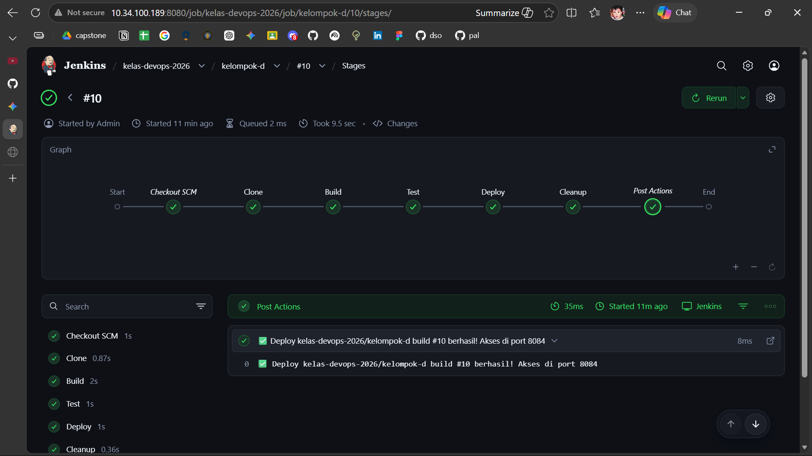
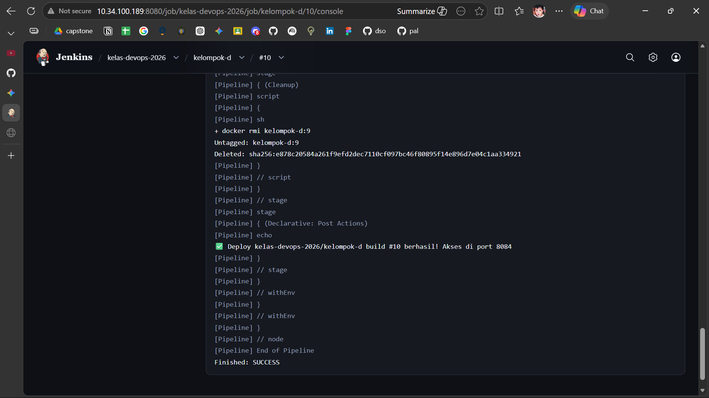
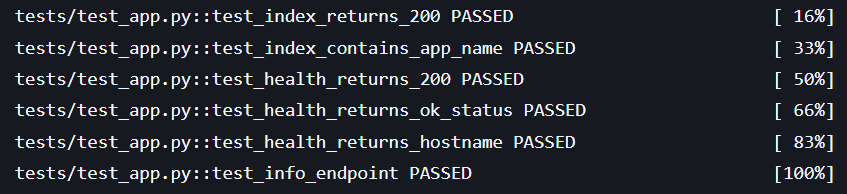
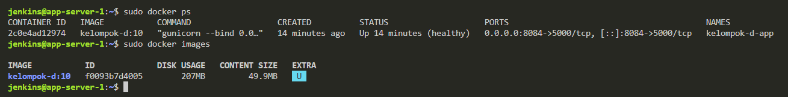
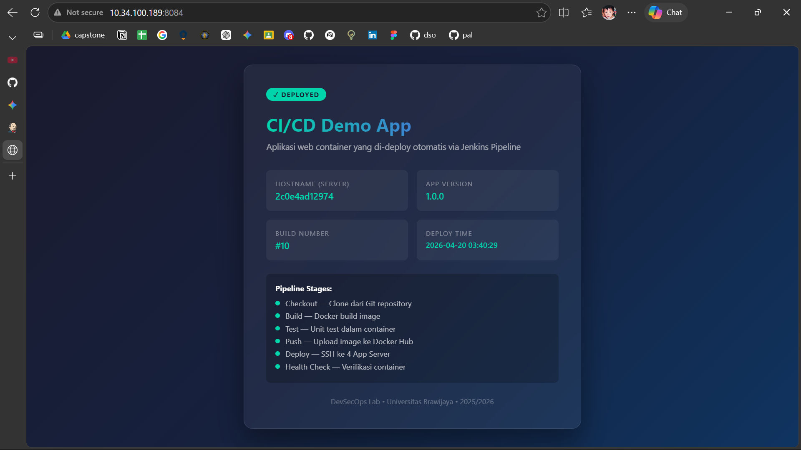

# Laporan Hands-on DevSecOps CI/CD - Kelompok 4

---

## Anggota Tim

| No | Nama                             | NIM             | 
| -- | -------------------------------- | --------------- | 
| 1  | Khaelano Abroor Maulana          | 235150200111051 | 
| 2  | I Made Deva Satria Wiguna Giri   | 235150200111054 | 
| 3  | Zaqia Mahadewi                   | 235150201111001 | 
| 4  | Syafa Syakira Shalsabilla        | 235150201111006 | 
| 5  | Jonathan Salim                   | 235150207111065 | 
| 6  | Aero Nathanael Silalahi          | 235150207111001 |  
| 7  | Niquita Aislam Az Zahara         | 245150207111057 | 
| 8  | Shafiyyah Daniswara Nurwijayanti | 245150207111061 |

---

## 1. Dashboard Jenkins (Pipeline Stage View)

*Keterangan: Screenshot dashboard Jenkins menunjukkan seluruh stage (Clone, Build, Test, Deploy, Cleanup) berwarna hijau (Success) untuk Job Kelompok 4.*

## 2. Console Output Jenkins (Build & Test Success)

*Keterangan: Bagian akhir dari console output yang menunjukkan pesan sukses '✅ Deploy berhasil!' serta hasil pengujian unit test menggunakan Pytest yang menunjukkan status PASSED.*

## 3. Verifikasi Container Aktif dan Docker Image di Server 

*Keterangan: Output perintah `sudo docker ps` yang menunjukkan container `kelompok-d-app` sedang berjalan (Up) dan memetakan port host 8084 ke port container 5000. Output dari perintah `sudo docker images` di server Jenkins. Terlihat image `kelompok-d:10` (atau tag terbaru) dengan status 'In Use' (U), yang membuktikan image berhasil dibuat dan sedang digunakan.*

## 4. Tampilan Aplikasi di Browser (Final)

*Keterangan: Tampilan aplikasi saat diakses melalui `http://10.34.100.200:8084` yang menunjukkan nomor Build #10 yang sesuai dengan di Jenkins membuktikan sinkronisasi variabel environment.*

---
**Catatan:**
- **Server Deployment:** Jenkins Server (VM-0)
- **Port:** 8084 (Kelompok 4)
- **Namespace Image:** kelompok-d
